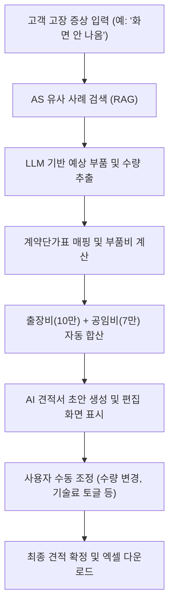

# AI 견적서 자동 생성 기능 구현 계획서

- **문서 버전**: v1.0
- **작성일**: 2026-06-18
- **상태**: 승인됨 (구현 대기)

---

## 1. 개요 및 구현 범위

본 문서는 `csautobot` 프로젝트에 **"AI 견적서 생성기"** 메뉴를 추가하고 고장 증상 입력 시 AS 이력을 검색하여 계약 단가를 매핑하고 견적서를 자동 산출하는 기능을 구축하기 위한 공식 기술 계획서입니다.

---

## 2. 시스템 아키텍처 및 데이터 흐름



---

## 3. 세부 파일별 구현 계획

### A. 데이터 및 스토리지 영역

#### [신규] [pricing_service.py](file:///d:/myProject/csautobot/csautobot/services/pricing_service.py)
- **위치**: `csautobot/services/pricing_service.py`
- **역할**: `docs/계약단가표-260522.xlsx` 파일의 `_260522` 시트를 직접 로드하여 메모리에 캐싱하고, 단가 정보를 제공하는 서비스 모듈입니다.
- **기능**:
  - `load_contract_pricing()`: 엑셀 파일 로드 및 단가 맵 구성 (구분/품명/규격/단가 정보 추출)
  - `get_item_price(item_name)`: 품명 매핑 및 단가 반환

---

### B. 도메인 및 백엔드 서비스 영역

#### [신규] [quotation_service.py](file:///d:/myProject/csautobot/csautobot/services/quotation_service.py)
- **위치**: `csautobot/services/quotation_service.py`
- **역할**: 입력된 고장 증상으로 RAG 검색을 진행하고, LLM을 호출하여 예상되는 부품명과 수량을 Pydantic 스키마 형태로 반환한 뒤 단가를 적용하여 계산합니다.
- **주요 스키마**:
  ```python
  from pydantic import BaseModel, Field

  class PartDetail(BaseModel):
      part_name: str = Field(description="단가표 상의 품명 또는 규격과 매핑되는 예상 부품명")
      qty: int = Field(default=1, description="필요 교체 수량")
      unit_price: int = Field(description="부품 단가")
      total_price: int = Field(description="부품 단가 * 수량")

  class QuotationDraft(BaseModel):
      symptom_summary: str = Field(description="증상 요약")
      likely_cause: str = Field(description="예상 고장 원인")
      parts: list[PartDetail] = Field(default_factory=list, description="예상 소요 부품 목록")
      dispatch_fee: int = Field(default=100000, description="출장 교통비 (기본 10만 원)")
      labor_fee: int = Field(default=70000, description="공임비 (기본 7만 원)")
      total_cost: int = Field(description="부품 총액 + 출장비 + 공임비")
  ```

#### [신규] [quotation.py](file:///d:/myProject/csautobot/csautobot/app/routes/quotation.py)
- **위치**: `csautobot/app/routes/quotation.py`
- **역할**: 백엔드 API 라우터에 견적서 관련 API를 등록합니다.
- **엔드포인트**:
  - `POST /api/v1/quotation/draft`: 증상 텍스트를 입력받아 AI 견적서 초안(`QuotationDraft`)을 생성하여 반환합니다.

#### [수정] [main.py](file:///d:/myProject/csautobot/csautobot/main.py)
- **변경 사항**: 신규 추가되는 `quotation_router`를 FastAPI 인스턴스에 등록합니다.
  ```python
  from app.routes.quotation import router as quotation_router
  app.include_router(quotation_router, prefix="/api/v1")
  ```

---

### C. 프론트엔드 영역 (Next.js)

#### [수정] [layout.tsx](file:///d:/myProject/csautobot/frontend/src/app/layout.tsx)
- **변경 사항**: 사이드바 내비게이션 메뉴(`PAGE_ORDER`)에 `"💡 AI 견적서 생성기"` 메뉴 등록
  ```typescript
  const PAGE_ORDER = [
    { name: "📊 운영 대시보드", path: "/dashboard" },
    { name: "📝 점검일지 AI 어시스턴트", path: "/inspection" },
    { name: "🔎 AS 유사 사례 검색", path: "/search" },
    { name: "💡 AI 견적서 생성기", path: "/quotation" },
    { name: "📂 학습 데이터 관리", path: "/data-management" },
    { name: "📬 피드백 모음", path: "/feedback" },
  ];
  ```

#### [신규] [page.tsx](file:///d:/myProject/csautobot/frontend/src/app/quotation/page.tsx)
- **위치**: `frontend/src/app/quotation/page.tsx`
- **역할**: 사용자가 고장 증상을 입력하고 견적 초안을 생성(FastAPI API 호출)한 뒤 실시간으로 수량 조절, 부품 추가/삭제, 기술 서비스료 조절을 진행하여 최종 공급가액과 부가세를 별도로 산출해내는 Next.js React 페이지입니다.
- **주요 UI 요소**:
  - **입력 섹션**: 고장 접수 증상 입력창, 충전기 구분(급속/완속) 선택, 초안 생성 버튼
  - **수동 부품 추가 섹션**: 부품명, 수량, 구분 입력 후 실시간 행 가산
  - **세부 부품 내역 테이블**: 예상 부품의 품명, 규격, 수량 조절(Number Input), 삭제(🗑️) 토글
  - **기술료 조절 섹션**: 출장 교통비 및 작업 공임비 개별 숫자 입력기
  - **비용 총괄 요약 카드**: 부품비 합계, 기술 서비스료 합계, **공급가액 총액**, **부가세 (VAT 10%)**, **최종 견적 금액 (합계)**의 다차원 금액 노출 (부가세 별도 구분 표시)
  - **다운로드 액션**: 브라우저 클라이언트 사이드에서 UTF-8-BOM 인코딩 기반의 **엑셀 호환 CSV 견적서 파일 다운로드** 기능 제공

---

## 4. 검증 및 수동 조치 예외 시나리오 설계

1. **완속 충전기 부품 교체 시 출장비 자동 제외**: 완속 충전기의 부품(예: UC1 보드)을 단순 점검 교체하는 케이스는 기본적으로 출장 교통비를 0원으로 설정하여 화면에 표시합니다.
2. **다중 부품 교체**: 콤마(`,`) 등으로 구분된 복수 부품을 단가표에서 개별 조회 및 추출하여 부품 합계에 정상 가산합니다.
3. **단가 템플릿의 커스텀 추가**: 단가표에 정의되지 않은 항목이나 임시 수리 공임(예: 펌웨어 업데이트 10만 원)의 경우, 임시 단가 매핑 테이블을 별도로 구성하여 오작동을 최소화합니다.

## 5. 비즈니스 룰 및 설계 확정 사항

1. **견적서 엑셀 다운로드 양식**:
   - 엑셀 양식이 첨부되거나 지정된 템플릿 경로에 존재할 경우 **첨부 양식(템플릿)**에 맞춰 값을 채워 다운로드합니다.
   - 사전에 정의된 양식이 없을 경우 시스템에서 **자체 생성한 표준 테이블 형태**의 엑셀 문서로 다운로드합니다.
2. **세율(VAT) 처리 방식**:
   - 모든 금액 화면 및 견적서 다운로드 시 **부가세(VAT) 별도를 명확히 구분하여 표시**합니다. (공급가액, 부가세 10%, 합계금액을 별도로 명시)
