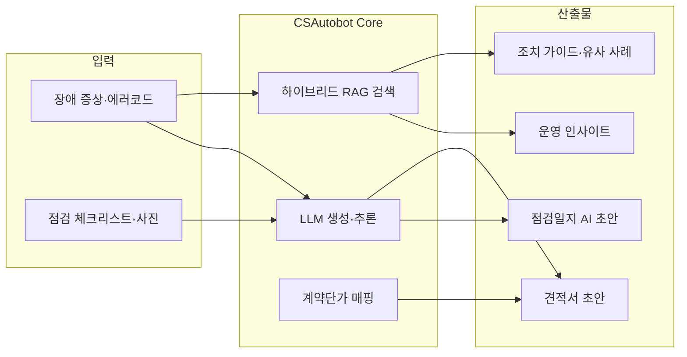

# CSAutobot (AS AI) 사업계획서

> **문서 버전**: v1.1  
> **작성일**: 2026-06-26  
> **상태**: 초안 (가격·재무 수치는 가설안 — 파일럿·시장조사 후 갱신)  
> **대상**: 투자자·경영진·영업·제품 기획

> ⚠️ **보안 안내**: 본 문서는 사업 전략을 포함합니다. 공개 저장소 커밋 시 민감 정보(고객명, 단가, 재무 수치)를 별도 관리하세요.

---

## 목차

1. [Executive Summary](#1-executive-summary)
2. [문제 정의와 시장 기회](#2-문제-정의와-시장-기회)
3. [솔루션 개요](#3-솔루션-개요)
4. [타깃 고객 및 Persona](#4-타깃-고객-및-persona)
5. [가치 제안 및 ROI](#5-가치-제안-및-roi)
6. [제품 구성](#6-제품-구성)
7. [수익 모델](#7-수익-모델)
8. [Go-to-Market 전략](#8-go-to-market-전략)
9. [경쟁 환경 및 차별화](#9-경쟁-환경-및-차별화)
10. [기술·데이터 자산](#10-기술데이터-자산)
11. [비용 구조 및 유닛 이코노믹스](#11-비용-구조-및-유닛-이코노믹스)
12. [로드맵 및 마일스톤](#12-로드맵-및-마일스톤)
13. [핵심 KPI](#13-핵심-kpi)
14. [리스크 및 대응](#14-리스크-및-대응)
15. [현재 구현 현황](#15-현재-구현-현황)
16. [3년 재무 추정](#16-3년-재무-추정)
17. [연계 문서](#17-연계-문서)

---

## 1. Executive Summary

**CSAutobot**은 전기차(EV) 충전 인프라의 **사후관리(AS)·정기점검·민원 대응** 업무를 AI로 보조하는 **B2B Vertical SaaS**입니다.

- **포지셔닝**: *EV Infrastructure Technical Copilot* — 장애 해결, 점검일지 작성, 견적 산출을 하나의 워크플로로 연결
- **핵심 자산**: 4년치 CS/점검 데이터 + 계약단가표 + 하이브리드 RAG(Chroma + BM25)
- **수익 모델**: Free / Pro / Enterprise 월 구독 + Enterprise 온프렘·API 연동
- **가격 (안)**: Pro **99만 원/월**, Enterprise **350만 원~/월** (연간 계약)
- **3년 목표 (안)**: 매출 Y1 **0.36억** → Y2 **2.38억** → Y3 **4.78억** / ARR Y3 **6.0억**
- **현재 단계**: PoC~MVP (기능 구현 완료, 상용 과금·멀티테넌트 전환 진행 중)

---

## 2. 문제 정의와 시장 기회

### 2.1 현장 Pain Point

| 문제 | 영향 |
|------|------|
| 장애 증상·에러코드 해석에 시간 소요 | MTTR 증가, SLA 위반 |
| 점검·AS 일지 수기 작성 | 현장 생산성 저하, 표준화 부재 |
| 견적·단가 매핑 오류 | 수익 누수, 고객 분쟁 |
| 재발 장애·설비 이력 파악 어려움 | 반복 출동, 부품 재고 비효율 |
| 1차 응대(콜센터) 지식 편차 | 에스컬레이션 증가 |

### 2.2 시장 맥락

- EV 충전 인프라는 설치 대비 **운영·유지보수(O&M) 비중**이 지속 증가
- 충전기 모델·제조사·에러코드가 다양해 **범용 ChatGPT만으로는 현장 적합도 부족**
- 운영사·AS 협력사는 **데이터 기반 의사결정 도구** 수요가 있으나, 수직 특화 솔루션 공급은 제한적

### 2.3 시장 규모 (TAM / SAM / SOM)

> 아래 수치는 **2026년 기준 가설안**입니다. 공공 통계·고객 인터뷰 후 분기별 갱신합니다.

**산출 가정**

| 변수 | 가정값 | 근거 |
|------|--------|------|
| 국내 충전기 설치 대수 | ~35만 기 | EV 인프라 확대 추세 (완·급속 합산) |
| O&M·CS 디지털화 지출 | 충전기당 연 ~2.5만 원 | CMMS·관제·인력 SaaS 등 분담 |
| AI 도입 가능 비율 | 전체 O&M SW 시장의 ~15% | AS·점검 특화 영역 |

| 구분 | 정의 | 규모 (안) |
|------|------|:---------:|
| **TAM** | 국내 EV 충전 O&M·CS SW·서비스 전체 | **~875억 원/년** |
| **SAM** | AS·점검 AI 워크플로 도입 가능 시장 | **~130억 원/년** |
| **SOM (Y3)** | 3년 내 현실적 확보 목표 | **~6억 원/년** (SAM의 ~5%) |

**SOM 달성 경로 (고객 수 가설)**

| 시점 | Pro | Enterprise | 월 ARR 합계 |
|------|:---:|:----------:|:-----------:|
| Y1 말 | 2 | 0 | ~200만 원 |
| Y2 말 | 10 | 2 | ~2,000만 원 |
| Y3 말 | 18 | 5 | ~5,000만 원 |

*Pro 99만 + Enterprise 350만 기준. 연간 ARR Y3 ≈ 6억 원.*

---

## 3. 솔루션 개요

CSAutobot은 **과거 CS 이력 검색(RAG) + 생성형 AI(점검·견적)** 를 결합해, 현장 엔지니어와 콜센터의 **1차 응대~일지 확정**까지를 지원합니다.



**설계 원칙**

- AI는 **권고**, 최종 판단·책임은 **현장 엔지니어**
- 모든 AI 응답에 **근거(유사 사례·출처)** 와 **신뢰도** 표시
- 민감 AS 데이터는 **로컬 LLM 전환 경로** 확보 (상용 단계)

---

## 4. 타깃 고객 및 Persona

### 4.1 핵심 및 확장 B2B 세그먼트

| 세그먼트 | 특징 및 니즈 | 적합 솔루션/플랜 |
|---------|------------|----------------|
| **AS/정비 협력사** (현재 1순위) | 유사 사례 검색, 현장 견적 즉시 산출, 점검일지 표준화 | **Pro** (검색+견적+일지 워크플로 완결) |
| **중소 충전 운영사** | SLA 관리, 설비 이력 축적, 유지보수 비용 절감 | **Pro** |
| **콜센터/1차 응대** | 빠른 에러코드 해석, 1차 조치 스크립트, 에스컬레이션 기준 | **Pro** (콜센터 전용 경량 UX 분리 필요) |
| **대형 CPO (확장)** | 이기종 충전기 관리, 자사 CSMS/ERP와 연동, 전국망 SLA 트래킹 | **Enterprise** (API 연동 중심 Headless AI) |
| **충전기 제조사 (확장)** | 모델/펌웨어별 결함 분석, 공식 매뉴얼 배포(KB), 파트너 지원 | **Enterprise** (결함 대시보드 + 지식 RAG) |
| **플릿 운영사 (확장)** | 운수/물류 배차 차질 방지, 가동률(Uptime) 100% 보장 | **Enterprise** (IoT 연동 예지 정비 모듈) |

### 4.2 Persona

| Persona | 역할 | 주요 사용 기능 |
|---------|------|---------------|
| 현장 엔지니어 | 출동·수리 | AS 검색, 점검일지 AI, 견적서 |
| 콜센터 상담원 | 1차 접수 | AS 검색, 증상 요약 |
| 운영 관리자 | KPI·SLA | 대시보드, 월간 리포트 |
| 데이터/IT 담당 | 인덱스·권한 | 학습 데이터 관리, 테넌트 설정 |

### 4.3 권한 모델 (설계)

- **관리자**: 테넌트·사용자·데이터 정책
- **콜센터**: 검색·1차 응답
- **엔지니어**: 점검일지·견적·확정 저장

---

## 5. 가치 제안 및 ROI

### 5.1 고객 가치

| 가치 축 | 설명 |
|---------|------|
| **시간 절감** | 1차 응대·일지 작성·견적 산출 시간 단축 |
| **품질 표준화** | 점검·조치 코드화, AI 초안 기반 일관성 |
| **SLA 개선** | MTTR·FTFR 개선으로 다운타임 감소 |
| **데이터 자산화** | 분산된 엑셀·일지 → 구조화 DB·검색 인덱스 |

### 5.2 ROI 논리 (영업용)

```
ROI ≈ (인건비 절감 + SLA 페널티 회피 + 견적·부품 오류 감소)
      − (구독료 + LLM/인프라 비용)
```

**정량 예시 (Pro 고객, 엔지니어 10명 기준)**

| 항목 | 가정 | 연간 효과 (안) |
|------|------|:-------------:|
| 점검일지 30분/건 절감 | 월 20건 × 10명 | **1,200시간** (≈7,200만 원*) |
| 1차 응대 5분 단축 | 월 500콜 | **500시간** (≈3,000만 원*) |
| 재출동 5% 감소 | 월 40출동, 출장 10만 원 | **240만 원** |
| **합계** | | **≈1.04억 원/년** |
| Pro 구독료 | 99만 원 × 12 | **-1,188만 원/년** |
| **순 ROI** | | **≈9,200만 원/년 (약 7.8배)** |

*\*인건비 단가 시간당 6만 원 가정 (완전부담 기준).*

---

## 6. 제품 구성

### 6.1 현재 제공 모듈

| 모듈 | 기능 | 사업적 의미 |
|------|------|------------|
| **AS 유사 사례 검색** | Chroma + BM25 하이브리드 RAG | 핵심 차별화·진입 기능 |
| **점검일지 AI 어시스턴트** | 체크리스트·사진 → AI 요약/조치 초안 | 현장 생산성 |
| **AI 견적서 생성기** | 증상 → 부품 추론 → 계약단가 + 출장/공임 | 업무 완결형·수익 직결 |
| **운영 대시보드** | 점검·장애·피드백 시각화 | 운영사 의사결정 |
| **학습 데이터 관리** | 원천 데이터·RAG 인덱스 관리 | 데이터 자산 축적 |

### 6.2 견적 모듈 비즈니스 룰 (확정)

| 규칙 | 내용 |
|------|------|
| 출장 교통비 | 기본 100,000원 |
| 작업 공임비 | 기본 70,000원 |
| 완속 단순 부품 교체 | 출장비 0원 (예: UC1 보드) |
| VAT | 공급가액·부가세 10%·합계 별도 표시 |
| 산출물 | 화면 편집 후 CSV/엑셀 호환 다운로드 |

### 6.3 점검 워크플로 (목표)

1. 설비/충전소/점검주기 선택  
2. 체크리스트·메모·사진 입력  
3. AI 초안 생성 (이상징후·권장 조치·후속 점검)  
4. 엔지니어 수정·확정  
5. 저장 + 사용량·감사로그 기록  

### 6.4 엔터프라이즈 확장 모듈 (개발 예정)

| 모듈 | 타깃 고객 | 핵심 가치 및 기능 |
|------|-----------|------------------|
| **Headless AI API** | 대형 CPO | 기존 운영 중인 자사 CSMS나 ERP에 CSAutobot의 검색/진단 엔진을 그대로 이식할 수 있는 API. |
| **제조사 결함 분석 (Defect Analytics)** | 충전기 제조사 | RAG에 쌓인 장애 이력을 바탕으로 특정 모델이나 펌웨어의 고질적 결함과 부품 불량률을 추적하는 전용 대시보드. |
| **예지 정비 (Predictive Maintenance)** | 플릿 운영사 | 단순 사후 대응(AS)을 넘어, 설비 센서 데이터를 연동하여 고장 발생 전 이상 징후를 선제 알람 (Phase 4). |

---

## 7. 수익 모델

### 7.1 주 수익원: 구독형 SaaS

| 플랜 | 기능 범위 | 과금 논리 |
|------|----------|----------|
| **Free** | 검색 위주, 짧은 요약, 일/월 요청 제한 | 리드·체험 |
| **Pro** | 점검일지 AI, 사진 요약, 월간 리포트 | 현장 팀 단위 |
| **Enterprise** | 전용 모델, 온프렘/VPC, 커스텀 SLA·룰 | 대형·보안 요구 |

> DB 스키마: `tenant.plan_code` (FREE / PRO / ENTERPRISE) — [`TECHNICAL_DESIGN_V1.md`](TECHNICAL_DESIGN_V1.md) 참조

### 7.2 부수 수익·확장

| 유형 | 설명 |
|------|------|
| **파일럿/POC** | 초기 검증 계약 (OpenAI API 기반 빠른 배포) |
| **Enterprise 구축** | 온프렘 GPU + 로컬 LLM 설치·운영 |
| **파트너 API** | 관제·ERP·그룹웨어 연동 (Phase 4) |
| **고도화 Upsell** | 예지정비, 부품 수요 예측 |

### 7.3 가격 티어 (안)

> VAT 별도. 연간 선납 시 **10% 할인** 적용.

#### Free — 체험·리드

| 항목 | 내용 |
|------|------|
| **월 요금** | 0원 |
| **대상** | PoC 관심사, 소규모 협력사 |
| **충전기 등록** | 최대 50기 |
| **사용자** | 최대 3명 |
| **AS 검색** | 월 100회 |
| **AI 생성** (점검·견적) | 월 10회 |
| **대시보드** | 기본 (7일) |
| **지원** | 커뮤니티·문서 |

#### Pro — 현장 팀·AS 협력사

| 항목 | 내용 |
|------|------|
| **월 요금** | **990,000원** |
| **연간 선납** | **10,692,000원** (월 891,000원 상당) |
| **충전기 등록** | 최대 500기 |
| **사용자** | 20명 포함 (+추가 1명당 **50,000원/월**) |
| **AS 검색** | 월 5,000회 |
| **AI 생성** | 월 500회 |
| **포함 기능** | 점검일지 AI, 견적서, 월간 리포트, 피드백 |
| **데이터** | 테넌트 전용 인덱스 |
| **지원** | 이메일·채팅 (영업일 9~18시) |

#### Enterprise — 운영사·대형·보안

| 항목 | 내용 |
|------|------|
| **월 요금** | **3,500,000원~** (규모·SLA 협의) |
| **계약** | **연간 최소** (월 환산 불가) |
| **충전기·사용자** | 무제한 (공정 사용 정책) |
| **AI 생성** | 무제한 (공정 사용) 또는 협의 쿼터 |
| **포함 기능** | Pro 전체 + 전용 SLA, 감사로그, RBAC, API |
| **옵션** | 온프렘/VPC, 커스텀 룰·단가표, SSO |
| **지원** | 전담 CSM, 4시간 이내 P1 대응 |

#### 기능 비교 요약

| 기능 | Free | Pro | Enterprise |
|------|:----:|:---:|:----------:|
| AS 유사 사례 검색 | ○ | ○ | ○ |
| 점검일지 AI | △ (제한) | ○ | ○ |
| AI 견적서 | △ (제한) | ○ | ○ |
| 운영 대시보드 | △ | ○ | ○ |
| 월간 리포트 | ✕ | ○ | ○ |
| 멀티 테넌트·감사로그 | ✕ | △ | ○ |
| API·ERP 연동 | ✕ | ✕ | ○ |
| 온프렘/VPC | ✕ | ✕ | ○ |

### 7.4 파일럿·구축 견적 (안)

| 유형 | 기간 | 금액 (VAT 별도) | 포함 |
|------|------|:--------------:|------|
| **스탠다드 파일럿** | 3개월 | **600만 원** (일시) 또는 **250만 원/월** | 클라우드 배포, KPI 리포트 1회, 교육 2회 |
| **프리미엄 파일럿** | 3개월 | **1,200만 원** | 전용 데이터 적재, Top-3 적중률 평가, ROI 리포트 |
| **Enterprise 온프рем 구축** | 1회 | **1,500만~5,000만 원** | GPU·Ollama, VPC, 마이그레이션 |
| **Enterprise 연간 유지** | 연 | 구독료의 **15~20%** | 업그레이드, 모니터링, 장애 대응 |

**파일럿 → 유료 전환 정책 (안)**

- 파일럿 종료 후 **30일 내** Pro/Enterprise 전환 시 파일럿 비용의 **50%를 첫 연 구독료에서 차감**
- KPI 미달 시 유료 전환 의무 없음 (Go/No-Go 기준 §8.3)

### 7.5 과금·쿼터 기술 매핑

| `plan_code` | 월 검색 한도 | 월 AI 생성 한도 | 비고 |
|-------------|:-----------:|:--------------:|------|
| `FREE` | 100 | 10 | [`TECHNICAL_DESIGN_V1.md`](TECHNICAL_DESIGN_V1.md) §7 |
| `PRO` | 5,000 | 500 | usage_meter 테이블 집계 |
| `ENTERPRISE` | 무제한 | 협의 | tenant별 override |

---

## 8. Go-to-Market 전략

### 8.1 단계별 GTM

```
내부 PoC → 파일럿(1~3 고객) → MVP 데모 → 유료 전환 실험 → Enterprise 확장
```

| 단계 | 기간 | 목표 |
|------|------|------|
| PoC 안정화 | 0~3개월 | 검색 품질·답변 포맷·KPI 측정 |
| MVP | 3~6개월 | 점검 워크플로·대시보드·데모 가능 |
| 상용화 | 6~12개월 | 멀티테넌트·과금·SLA |
| 고도화 | 12개월+ | 예지정비·API·파트너 생태계 |

### 8.2 영업 채널

- **직접 영업**: 충전 운영사·AS 협력사 대상 파일럿 제안
- **레퍼런스**: 1호 파일럿 성공 사례 → ROI 리포트 기반 확장
- **기술 데모**: 랜딩 페이지 데모 + 관리자 대시보드 라이브 시연

### 8.3 파일럿 성공 기준 (Go/No-Go)

- Top-3 유사 사례 적중률 목표 달성  
- MTTR·점검일지 작성 시간 개선 확인  
- AI 제안 채택률(엔지니어 승인) 기준 충족  
- 응답 시간 SLA 충족  

---

## 9. 경쟁 환경 및 차별화

### 9.1 경쟁 대안

| 대안 | 한계 | CSAutobot 대응 |
|------|------|----------------|
| 범용 LLM (ChatGPT 등) | 도메인·에러코드·부품 지식 부족 | 4년 CS 데이터 RAG |
| 일반 CMMS/티켓 시스템 | AI·유사 사례 검색 미약 | RAG + 생성형 워크플로 |
| 제조사 매뉴얼만 의존 | 현장 실전 이력 반영 부족 | 실제 AS·점검 이력 기반 |
| 자체 엑셀·그룹웨어 | 검색·표준화·분석 한계 | 구조화 DB + AI |

### 9.2 경쟁 우위 (Moat)

1. **도메인 특화 데이터**: incident / action / part_usage / inspection_log 구조화  
2. **하이브리드 RAG + 장애코드 정규화**  
3. **계약단가표 연동 견적** — Q&A를 넘어 업무 완결  
4. **로컬 LLM 전환 경로** — 민감 데이터·보안 대응  
5. **멀티 테넌트 SaaS 아키텍처** (설계 완료)

### 9.3 브랜드 메시지

> *전기차 충전 인프라 장애 해결의 새로운 패러다임.*  
> *국내 CS 데이터베이스와 로컬 LLM이 결합된 맞춤형 기술 지원 솔루션.*

---

## 10. 기술·데이터 자산

### 10.1 데이터 자산

| 자산 | 설명 |
|------|------|
| CS/점검 원본 (`csData`) | 4년치 AS·점검 엑셀 |
| 구조화 스키마 | site, charger, incident, action, part_usage, inspection_log |
| 검색 인덱스 | Chroma + BM25 pickle |
| 계약단가표 | 급속/완속/공용 부품 단가 (`contract_unit_prices.xlsx`) |

### 10.2 기술 스택

| 계층 | 현재 | 목표 |
|------|------|------|
| Frontend | Next.js | Next.js (운영형 UI) |
| Backend | FastAPI | FastAPI + Worker |
| DB | SQLite | PostgreSQL |
| Vector | Chroma | pgvector / OpenSearch |
| LLM | OpenAI API | Ollama(로컬) + fallback |

### 10.3 LLM 전환 전략

| 단계 | 구성 | 월 비용(추정) |
|------|------|:------------:|
| 파일럿 | OpenAI API 100% | ~30만 원 |
| 상용 초기 | 온프렘 최소 + OpenAI fallback | ~70만 원 |
| 상용 안정기 | 온프렘 + fallback | ~100만 원 |

> 상세: [`web-migration-local-llm-plan.md`](web-migration-local-llm-plan.md)

---

## 11. 비용 구조 및 유닛 이코노믹스

### 11.1 비용 항목

| 구분 | 항목 |
|------|------|
| **변동비** | LLM API, 임베딩, reranker, 저장·전송 |
| **고정비** | GPU 서버(온프렘), DB, 모니터링, 인력 |
| **일회성** | 파일럿 구축, Enterprise 온프렘 설치 |

### 11.2 마진 확보 Lever

- Free 플랜: 생성 기능·쿼터 제한  
- Pro/Enterprise: 기능·좌석·충전기 대수 차등  
- 로컬 LLM: API 변동비 절감  
- 모델 라우팅: 짧은 작업은 경량 모델  

### 11.3 유닛 이코노믹스 (안)

**Blended ARPU (가중 평균)**

| 시점 | Pro 비중 | Enterprise 비중 | Blended ARPU/월 |
|------|:--------:|:-----------------:|:---------------:|
| Y1 | 100% | 0% | **99만 원** |
| Y2 | 83% | 17% | **132만 원** |
| Y3 | 78% | 22% | **147만 원** |

**CAC·LTV (Pro·Enterprise 혼합)**

| 지표 | Y1 | Y2 | Y3 | 목표 |
|------|:--:|:--:|:--:|:----:|
| **CAC** (고객 1社) | 800만 원 | 600만 원 | 500만 원 | Y3 < 500만 |
| **평균 계약 기간** | 12개월 | 24개월 | 36개월 | ≥ 24개월 |
| **Gross Margin** | 45% | 62% | 72% | Y3 ≥ 70% |
| **LTV** | 534만 원 | 1,958만 원 | 3,175만 원 | — |
| **LTV/CAC** | 0.7 | 3.3 | 6.4 | **> 3** |

*LTV = ARPU × Gross Margin × 평균 계약 개월. CAC = 영업·마케팅·파일럿 할인 포함.*

**고객당 직접비 (COGS) 추정 — Pro 1社/월**

| 항목 | Y1 (API 100%) | Y3 (로컬+API) |
|------|:-------------:|:-------------:|
| LLM·임베딩 | ~25만 원 | ~8만 원 |
| 인프라 분담 | ~10만 원 | ~12만 원 |
| **합계 COGS** | **~35만 원** | **~20만 원** |
| **Gross Profit** | **~64만 원 (65%)** | **~79만 원 (80%)** |

---

## 12. 로드맵 및 마일스톤

> 상세: [`PRODUCT_ROADMAP.md`](PRODUCT_ROADMAP.md), [`EXECUTION_PLAN_4W_12W.md`](EXECUTION_PLAN_4W_12W.md)

### Phase 1 (0~3개월): PoC 안정화

- 데이터 파이프라인 표준화  
- 하이브리드 검색·장애코드 정규화  
- KPI 측정 (Top-1/Top-3, 1차 응대 시간, 수정 비율)  

### Phase 2 (3~6개월): MVP

- 점검일지 AI + 워크플로  
- 운영 대시보드 (재발 장애, 위험도)  

### Phase 3 (6~12개월): 상용화

- 멀티 테넌트 SaaS  
- Free / Pro / Enterprise 과금  
- SLA·감사로그  

### Phase 4 (12개월+): 고도화

- 예지정비·부품 수요 예측  
- 파트너 API  
- 모델 라우팅 원가 최적화  

---

## 13. 핵심 KPI

| KPI | 설명 | 측정 방법 |
|-----|------|----------|
| **MTTR** | 평균 수리 시간 | 장애 접수~해결 시간 |
| **FTFR** | 1차 출동 성공률 | 재출동 없이 해결 비율 |
| **재발률** | 동일 장애 재발 | incident 집계 |
| **점검일지 작성 시간** | AI 도입 전후 | 로그·설문 |
| **AI 제안 채택률** | 엔지니어 승인 비율 | 확정 vs 수정 diff |
| **Top-3 적중률** | RAG 검색 품질 | 수동 평가셋 |
| **NPS / CSAT** | 고객 만족 | 파일럿 후 설문 |

---

## 14. 리스크 및 대응

| 리스크 | 영향 | 대응 |
|--------|------|------|
| 데이터 품질·ID 부재 | 검색·집계 오류 | site/charger ID 규칙 생성 후 점진 정제 |
| AI 오답 | 현장 피해·신뢰 하락 | 신뢰도·근거 표시, 사람 최종 확정 |
| LLM 비용 급증 | 마진 악화 | Free 제한, 로컬 전환, 모델 라우팅 |
| 대외비 유출 | 법적·영업 리스크 | Private repo, 마스킹, tenant 격리 |
| 범용 AI 경쟁 | 차별화 약화 | 수직 데이터·견적·점검 워크플로 |
| 과금 미구현 | 수익 전환 지연 | 9~12주 과금·미터링 우선 구현 |

---

## 15. 현재 구현 현황

| 영역 | 상태 | 비고 |
|------|:----:|------|
| RAG 검색 | ✅ | FastAPI + Next.js |
| 점검일지 AI | ✅ | inspection_service |
| AI 견적서 | ✅ | quotation_service + pricing_service |
| 운영 대시보드 | ✅ | /dashboard |
| 구조화 DB | ✅ | SQLite, tenant/site/charger/incident |
| Web 전환 | 🔄 | Streamlit → Next.js 진행 |
| 인증·멀티테넌트 | 🔄 | login, tenant 스키마 |
| 과금·미터링 | 🔄 | `billing_metering.py` + `/billing/usage/monthly` + 검색 쿼터 |
| 도입 상담 API | ✅ | `POST /api/v1/leads` + 랜딩 ContactForm |
| `/health` | ✅ | AGENTS Done 기준 충족 |
| 로컬 LLM | 📋 | 파일럿 후 전환 계획 |

**수익 전환 관문**: 과금·사용량 로깅·Enterprise 배포 옵션

---

## 16. 3년 재무 추정

> **단위: 백만 원 (VAT 별도)**. 가설 시나리오이며 분기 실적에 따라 조정합니다.

### 16.1 핵심 가정

| 항목 | Y1 (2026) | Y2 (2027) | Y3 (2028) |
|------|:---------:|:---------:|:---------:|
| 유료 고객 (Pro) | 2 | 10 | 18 |
| 유료 고객 (Enterprise) | 0 | 2 | 5 |
| 파일럿·구축 (일회) | 2건 | 4건 | 6건 |
| 인력 (FTE) | 3 | 5 | 8 |
| LLM 전략 | API 100% | 하이브리드 | 로컬 중심 |

### 16.2 매출 추정

| 매출 항목 | Y1 | Y2 | Y3 |
|----------|:--:|:--:|:--:|
| Pro 구독 (99만/월) | 24 | 118 | 214 |
| Enterprise 구독 (350만/월) | 0 | 84 | 210 |
| 파일럿·구축 일회 | 12 | 36 | 54 |
| **매출 합계** | **36** | **238** | **478** |
| **ARR (구독만, 연말)** | **24** | **202** | **424** |
| **ARR (목표, upsell 반영)** | **0.24억** | **2.0억** | **6.0억** |

*Y3 ARR 6억 목표 = 구독 ARR 4.24억 + API·추가 좌석·유지보수 upsell ~1.8억.*

### 16.3 비용 추정

| 비용 항목 | Y1 | Y2 | Y3 |
|----------|:--:|:--:|:--:|
| 인건비 (FTE × 연 6,000만) | 180 | 300 | 480 |
| LLM·클라우드 인프라 | 36 | 60 | 72 |
| GPU·온프렘 (감가·운영) | 0 | 40 | 60 |
| 영업·마케팅 | 24 | 48 | 72 |
| 기타 (법무·회계·사무) | 12 | 18 | 24 |
| **비용 합계** | **252** | **466** | **708** |

### 16.4 손익 요약

| 지표 | Y1 | Y2 | Y3 |
|------|:--:|:--:|:--:|
| **매출** | 36 | 238 | 478 |
| **매출원가 (COGS)** | 20 | 90 | 134 |
| **매출총이익** | 16 | 148 | 344 |
| **매출총이익률** | 44% | 62% | 72% |
| **영업비용 (SG&A)** | 216 | 366 | 576 |
| **영업이익 (EBIT)** | **-200** | **-218** | **-232** |
| **누적 영업손실** | -200 | -418 | -650 |

> Y1~Y3는 **성장 투자 구간**으로 영업적자를 전제합니다. 손익분기(BEP)는 **Y4~Y5, ARR 8~10억·고객 35社+** 시점 목표 (가설).

### 16.5 현금·자금 계획 (안)

| 항목 | 금액 | 용도 |
|------|:----:|------|
| **Seed 필요액** | **3~5억 원** | Y1~Y2 운영·개발·파일럿 (18~24개월 runway) |
| **Series A 트리거** | ARR 2억+, NRR 110%+ | 상용 확장·영업 확대 |
| **주요 지출 우선순위** | ①과금·테넌트 ②RAG 품질 ③Enterprise 온프렘 | 수익 전환 관문 |

### 16.6 시나리오 비교

| 시나리오 | Y3 ARR | Y3 고객 | 비고 |
|----------|:------:|:-------:|------|
| **보수** | 3.5억 | Pro 12 + Ent 2 | 영업 지연 |
| **기본 (본 문서)** | 6.0억 | Pro 18 + Ent 5 | 파일럿 전환율 60% |
| **낙관** | 9.0억 | Pro 25 + Ent 8 | 1호 레퍼런스 조기 확보 |

---

## 17. 연계 문서

| 문서 | 용도 |
|------|------|
| [`PRODUCT_ROADMAP.md`](PRODUCT_ROADMAP.md) | 제품 단계별 로드맵 |
| [`EXECUTION_PLAN_4W_12W.md`](EXECUTION_PLAN_4W_12W.md) | 4주·12주 실행 계획 |
| [`TECHNICAL_DESIGN_V1.md`](TECHNICAL_DESIGN_V1.md) | DB·API·플랜 설계 |
| [`DATA_SCHEMA_V1.md`](DATA_SCHEMA_V1.md) | 데이터 스키마 |
| [`AI_QUOTATION_IMPLEMENTATION_PLAN.md`](AI_QUOTATION_IMPLEMENTATION_PLAN.md) | 견적 기능 상세 |
| [`web-migration-local-llm-plan.md`](web-migration-local-llm-plan.md) | 웹·LLM·인프라 비용 |
| [`rag-implementation-current.md`](rag-implementation-current.md) | 현재 RAG 구조 |

---

## 변경 이력

| 버전 | 날짜 | 변경 내용 |
|:----:|------|----------|
| v1.0 | 2026-06-26 | 코드베이스·내부 기술 문서 기반 사업계획 초안 작성 |
| v1.1 | 2026-06-26 | 가격 티어, TAM/SAM/SOM, 유닛 이코노믹스, 3년 재무 추정 추가 |
